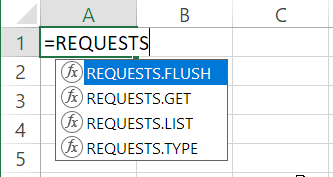
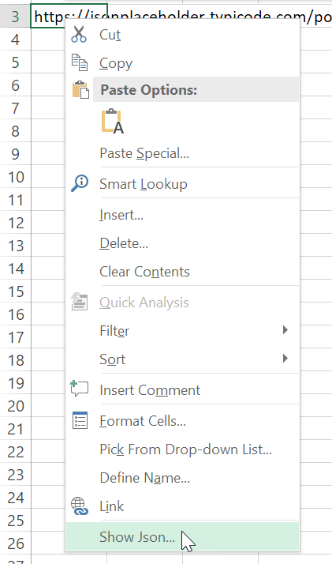

#################################
Excel Requests: HTTP for Spreadsheets
#################################

.. image:: https://ci.appveyor.com/api/projects/status/m5uqt0mdftmvu9of?svg=true

Excel Requests is an Excel Addin for painfree HTTP interaction in Excel. Excel Requests allows you to send organic, grass-fed HTTP/1.1 requests,
without the need for manual labuor.

Excel Requests is heavily inspired by Kenneth Reitz' popular `Python Requests <http://docs.python-requests.org/>`_.

===================
Excel Functionality
===================

Exposed User Defined Functions (UDF):

- REQUESTS.GET
- REQUESTS.LIST
- REQUESTS.FLUSH

Cell context menu (right click on a cell with a valid URL):

- Show Json

===================
Installation
===================

To install Excel Requests, simply:

===================
License & Authors
===================

- This project is maintained by `ZoomerAnalytics LLC <https://www.zoomeranalytics.com>`_
- For support, please open an issue or drop us an email `info@zoomeranalytics.com <mailto:info@zoomeranalytics.com>`_.
- This project is licensed under the terms of the `BSD license <https://opensource.org/licenses/BSD-3-Clause>`_
